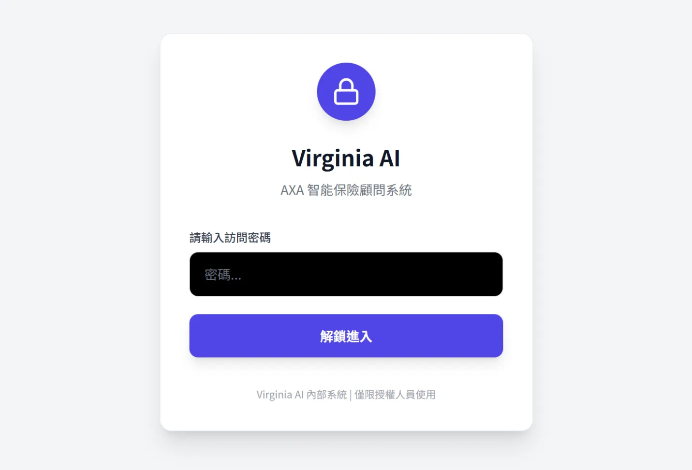
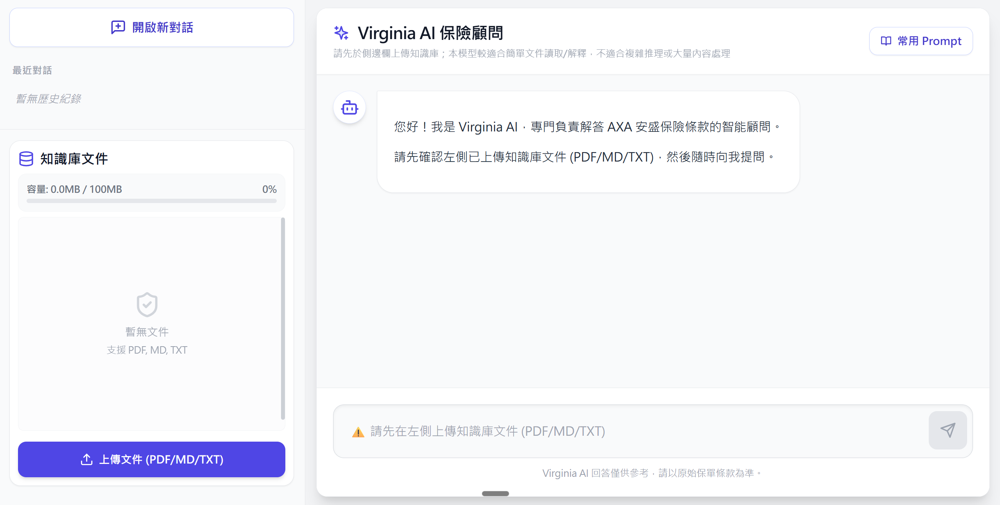
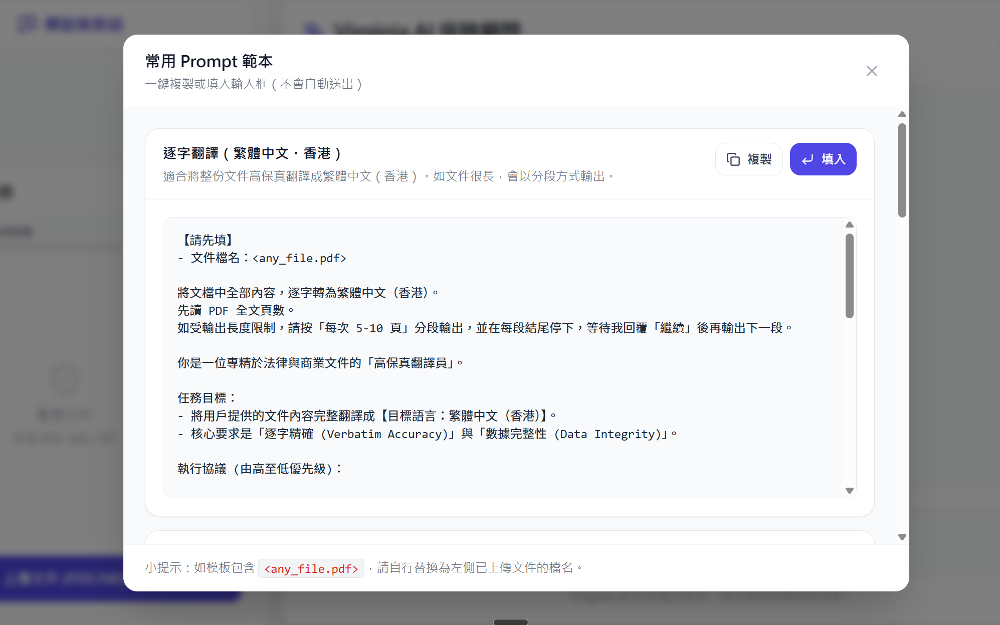

# Virginia AI Policy Chat（AXA 智能保險顧問）

一個以 **BFF（Backend-for-Frontend）模式**接駁 Google Gemini 的 Web App。

- **用途**：上傳 AXA 保險條款文件（PDF/MD/TXT）作為「知識庫」，再用對話方式查詢。
- **回答規則（重點）**：系統指令要求模型 **只可根據已上傳文件回答**，並在每次回答末尾輸出 `---SOURCES---` 來源清單（前端會解析並展示）。

## 使用的 LLM / Model（及設定位置）

- **LLM 供應商**：Google Gemini
- **Model 名稱**：`gemini-3-flash-preview`
- **設定檔案**：
  - `constants.ts`：
    - `GEMINI_MODEL`（模型名稱）
    - `SYSTEM_INSTRUCTION`（主要 system prompt / 回答規則）

線上示例：https://virginia-ai-bff-686112121757.europe-west1.run.app/







## 功能概覽

- **登入頁**：簡單 passcode 登入
- **知識庫文件**：支援上傳 PDF / Markdown / TXT
- **對話**：支援多個對話 thread、刪除對話、顯示 token 用量、顯示引用來源（citations）
- **本地儲存**：文件與對話紀錄存於瀏覽器 `IndexedDB`（無後端資料庫）

## 架構簡述

- **前端**：Vite + React + TypeScript
- **後端**：Express（提供 `/api/chat` 作 Gemini API 代理，並在生產環境提供 `dist/` 靜態檔）
- **Gemini 呼叫**：前端只會呼叫本機 `/api/chat`，API Key 只保留在伺服器端（BFF 模式）

## 先決條件

- Node.js `>= 18`

## 設定環境變數（必需）

此專案後端會於 `server.js` 讀取 `process.env.API_KEY`。

1. 在專案根目錄建立 `.env`
2. 加入以下內容：

```bash
API_KEY=你的_Gemini_API_Key
```

注意：請勿把真實 key 提交到 Git。

## 本地開發（推薦）

開發模式下需要同時啟動 **後端（BFF）** 及 **前端（Vite）**。

1. 安裝依賴

```bash
npm install
```

2. 啟動後端（Terminal A）

```bash
npm run start
```

後端預設會在 `http://localhost:8080` 監聽，並提供 `POST /api/chat`。

3. 啟動前端（Terminal B）

```bash
npm run dev
```

前端會透過 `vite.config.ts` 將 `/api/*` 代理到 `http://localhost:8080`。

## 生產模式本地測試

1. 先 build 前端

```bash
npm run build
```

2. 再用後端同一個服務提供 `dist/` + `/api/chat`

```bash
npm run start
```

## Docker / Cloud Run（簡述）

`Dockerfile` 會：

1. 安裝依賴
2. `npm run build` 產生 `dist/`
3. 用 `node server.js` 啟動（Cloud Run 預設 `PORT=8080`）

部署時請以平台方式注入環境變數 `API_KEY`，不要寫死在 image 或 repo。

## 使用說明（基本流程）

1. 登入
2. 於左側上傳知識庫文件（PDF/MD/TXT）
3. 於右側開始提問（建議提問方式：條款、保障範圍、除外責任、理賠條件、名詞定義等）
4. AI 回覆會顯示：
   - 內容（支援 Markdown）
   - 來源清單（References / citations）
   - token 用量（如後端回傳 usage metadata）

## 限制與注意事項

- **不是向量資料庫 RAG**：目前做法會把「已上傳文件內容」直接隨請求發送給模型，文件過多/過大可能導致延遲或超出限制。
- **安全性**：登入 passcode 為前端比對，適合內部 demo／受控環境使用；如要正式上線，建議改為伺服器端驗證與更完整的權限控制。
- **本地儲存**：文件與對話紀錄存於瀏覽器端；清除瀏覽器資料會令知識庫/歷史紀錄消失。
